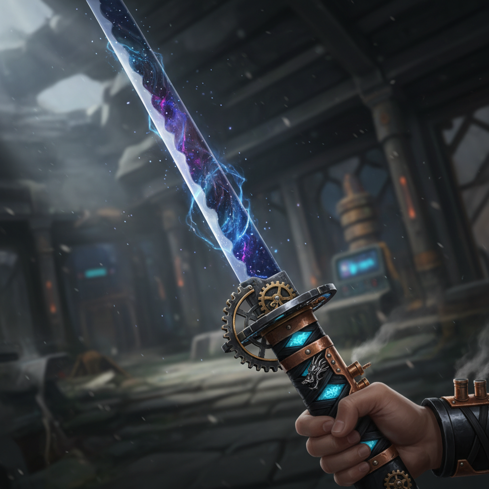
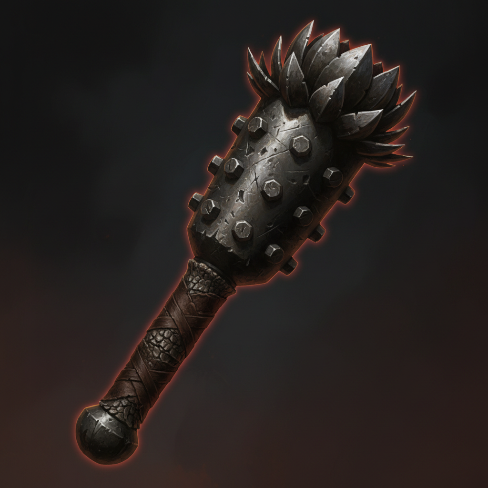
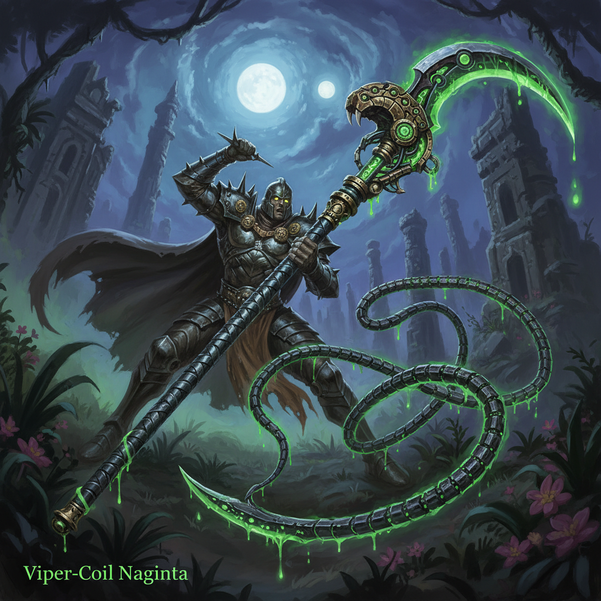
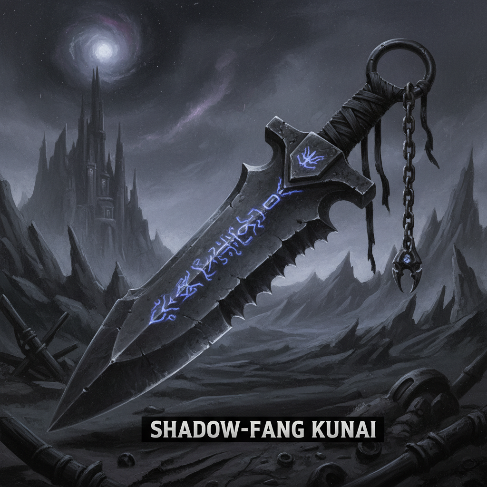
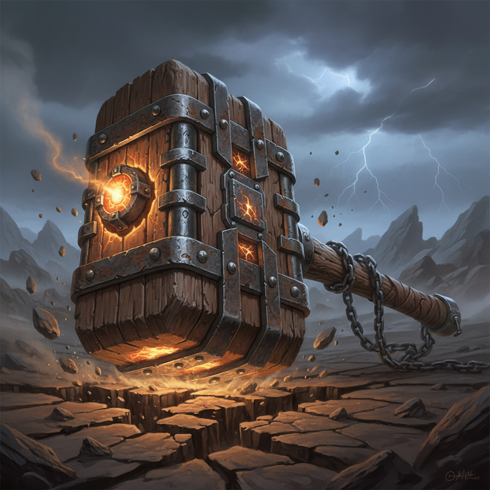
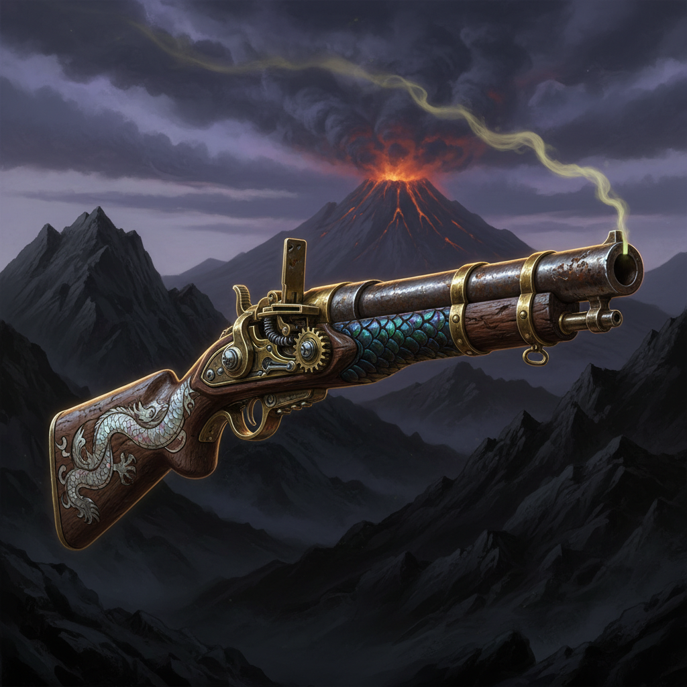
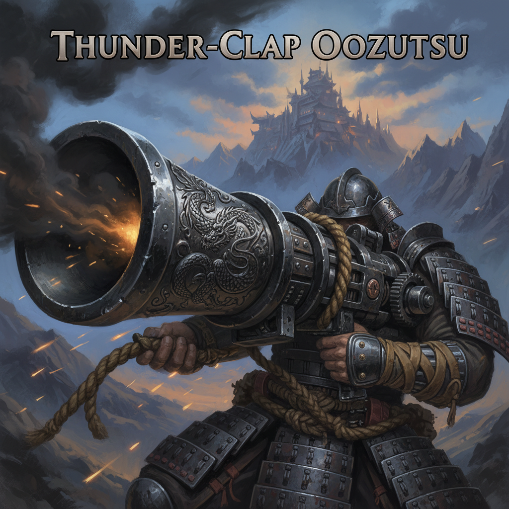
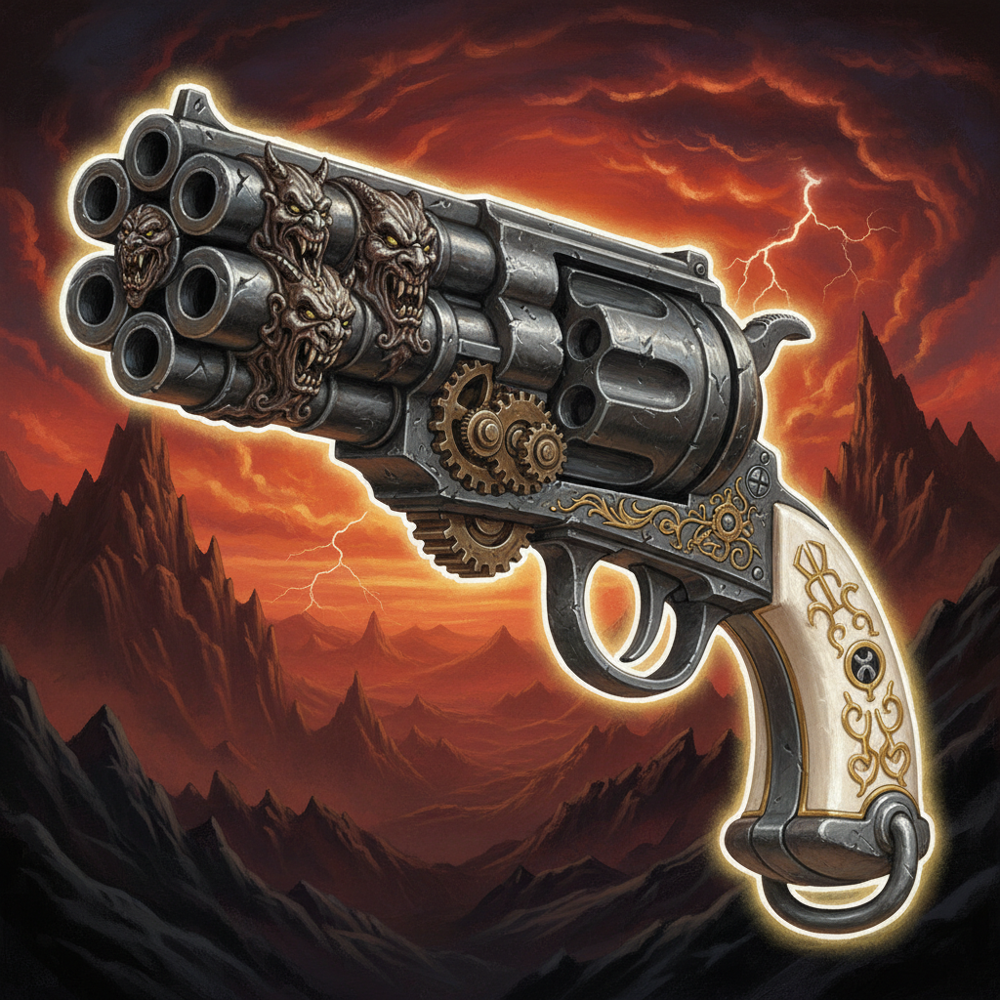
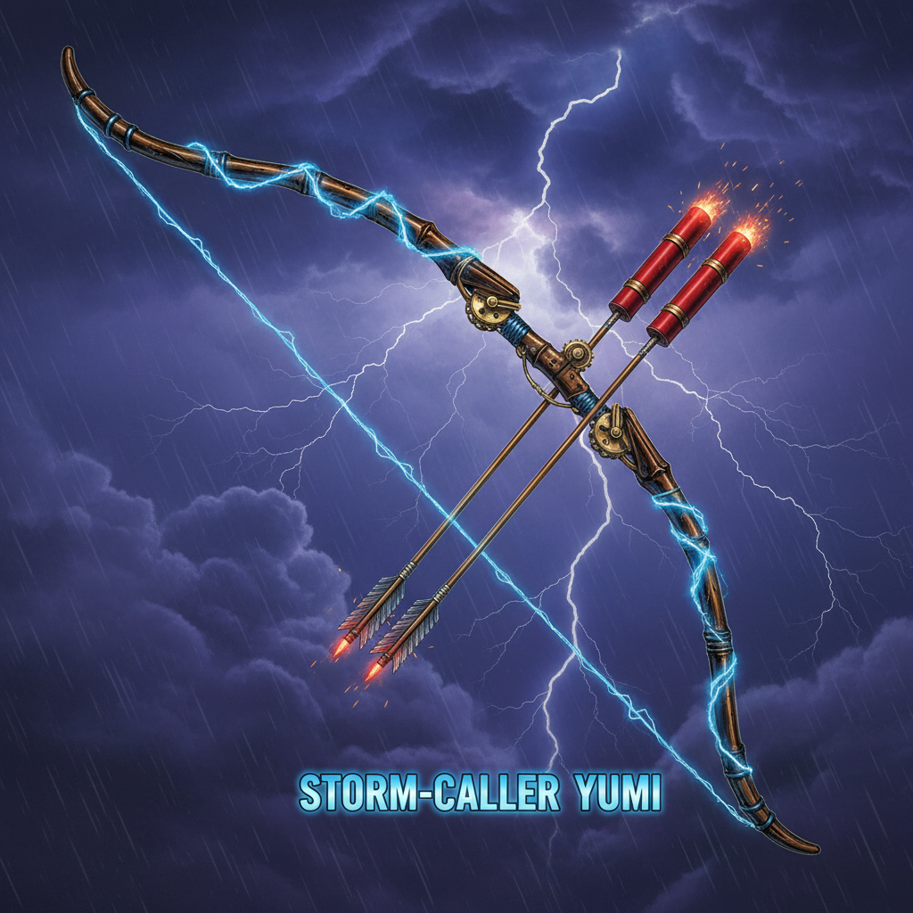

[◄ Back to Table of Contents](../TOC.md) | [◄ Art Style Overview](00_art_style_overview.md)

---

# Weapon Concepts

> **Note:** This document contains concept art and descriptions for the 9 core weapons.

## 1. Melee Weapons
### Void Edge Katana

*Standard issue samurai sword with a void-touched blade.*

### Iron Lotus Kanabo

*Heavy iron club designed to crush dinosaur armor.*

### Viper Coil Naginata (Yari)

*Long-reaching polearm for keeping beasts at bay.*

### Shadow Fang Kunai

*Throwing daggers for stealth kills.*

### Quake Hammer (Otsuchi)

*Massive hammer for breaching defenses.*

## 2. Ranged Weapons (Gunpowder)

### Dragon's Breath Matchlock

*Standard infantry rifle. Slow reload, devastating impact.*

### Thunder Clap Oozutsu (Hand Cannon)

*Portable cannon for anti-structure fire.*

### Six Demon Revolver

*Experimental repeating pistol.*

### Storm Caller Yumi

*Heavy bow firing gunpowder-tipped arrows.*

---

## Navigation

[◄ Art Style Overview](00_art_style_overview.md) | [◄ Back to Table of Contents](../TOC.md)
