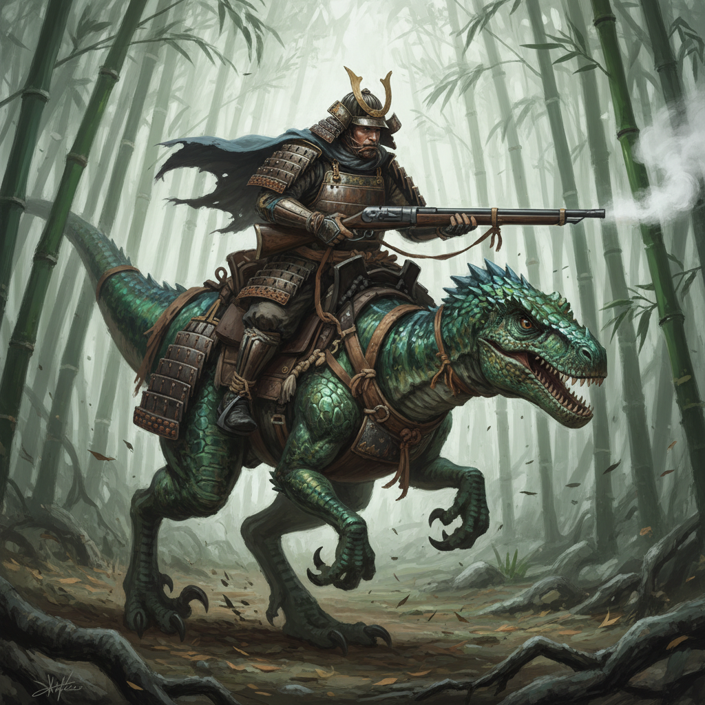
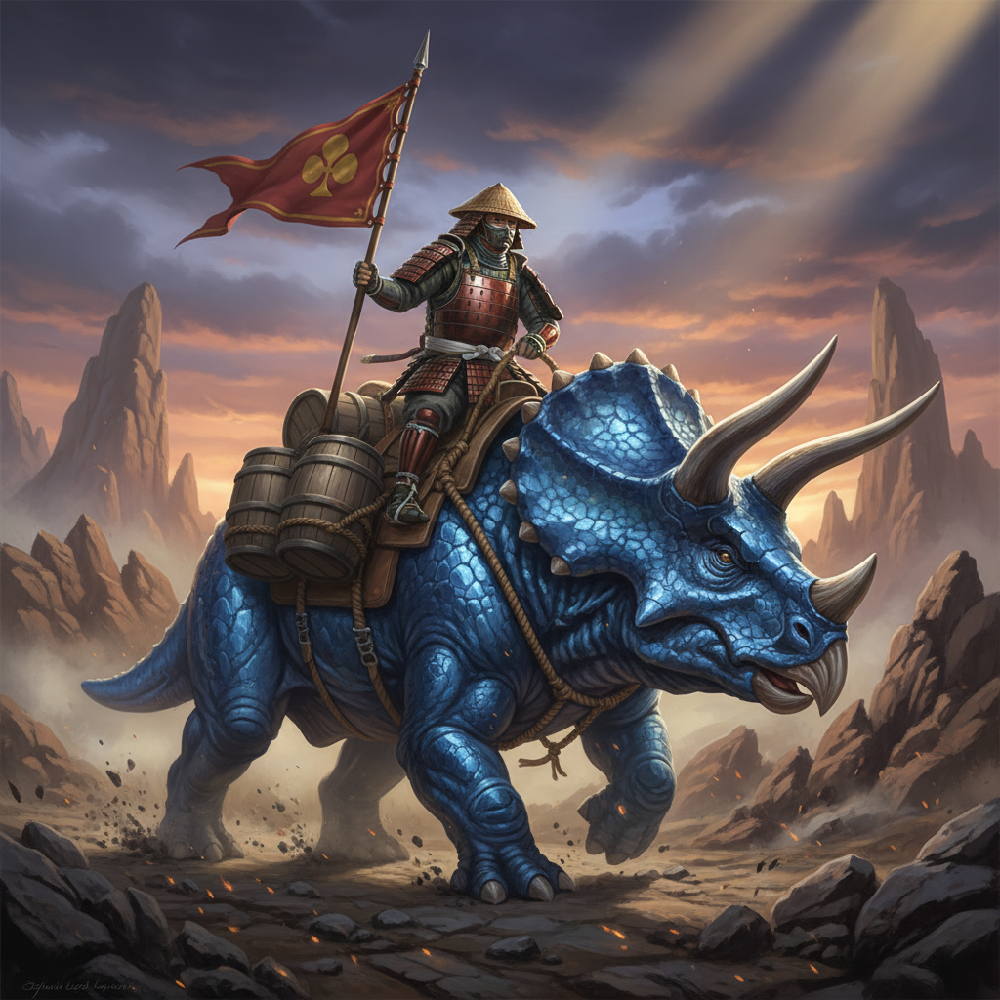

[◄ Back to Table of Contents](../TOC.md) | [◄ Weapon Concepts](01_weapon_concepts.md)

---

# Character & Creature Concepts

> **Note:** This document showcases the "Gunpowder & Scales" aesthetic applied to the playable dinosaur classes.

## 1. The Roster

### Ronin Raptor

*The Scout. Agile, deadly, and lightly armored with silk and lacquer.*

### Shogun T-Rex

*The Tank. Massive, imposing, and clad in heavy O-yoroi plating.*

### Ashigaru Triceratops

*The Support. A living fortress with defensive barricades and banners.*

---

## Navigation

[◄ Weapon Concepts](01_weapon_concepts.md) | [◄ Back to Table of Contents](../TOC.md)
