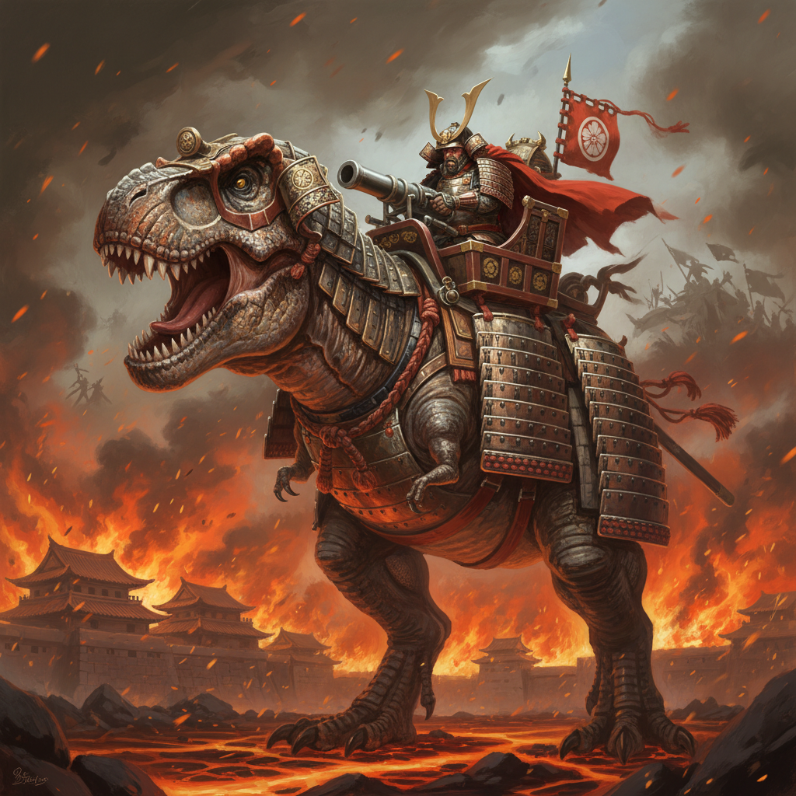

# Rovtier 🦖⚔️

> **"Gunpowder & Scales"** — Feudal Japan meets Prehistoric Nature in a visceral VR Extraction Shooter.

## 🎮 Overview

**Rovtier** is a 16-player PvPvE VR Extraction Shooter where your "Base" is not a building—it's a massive, living **Titan Dinosaur**.

Set in a fractured world where samurai armor is forged for beasts and matchlock rifles crack like thunder, teams must compete in **"Nest Wars"**. Your goal: Infiltrate the wild, secure dinosaur eggs, and extract them back to your Matriarch to breed the next generation of war beasts.

## 🌟 Key Features

*   **The Matriarch (Living Base):** Defend a colossal, moving Titan that serves as your spawn point and extraction zone.
*   **Symbiotic Combat:** Fight on foot with matchlock weapons and katanas, or mount your bonded dinosaur for devastating melee attacks.
*   **"Golden Axe" Mechanics:** Knock enemies off their mounts and steal their dinosaurs in the heat of battle.
*   **Visceral VR Interaction:** Physically climb beasts, reload black powder weapons manually, and feel the weight of the world.
*   **The Hatchery:** A deep breeding meta-game where extracted eggs determine your future loadouts and abilities.

## 📚 Game Design Document (GDD)

The complete design documentation for Rovtier is available in the `GDD` folder.

👉 **[Start Here: Master Table of Contents](GDD/TOC.md)**

### Quick Links
*   **[🌍 World & Setting](GDD/Core_Docs/04_world_and_setting.md)**: Explore the "Gunpowder & Scales" aesthetic.
*   **[⚔️ Gameplay Mechanics](GDD/Core_Docs/02_mechanics.md)**: Learn about "Wallbang" systems and dismemberment.
*   **[🦖 Factions & Roster](GDD/Core_Docs/03_factions_and_roster.md)**: Meet the Ronin Raptor and Shogun T-Rex.
*   **[🎨 Art Style Guide](GDD/Art_Style_Guide/00_art_style_overview.md)**: View the visual pillars and concept art.

## 🛠️ Technical Stack

*   **Engine:** Unity 6 (URP)
*   **Platform:** OpenXR (PCVR & Standalone)
*   **Networking:** Fish-Net + Epic Online Services (EOS)
*   **Architecture:** P2P with Host-Client topology

## 👥 Contributing

Rovtier follows an **"Open Studio"** philosophy. We welcome contributions from the community!

*   **[Contribution Guide](GDD/Community_Guide/00_contribution_overview.md)**: Learn how to become a Scout, Architect, or Warlord.
*   **The Hatchery:** Submit art and sound assets.
*   **The Forge:** Submit code and bug fixes.

---

*Rovtier — Hunt. Extract. Evolve.*
